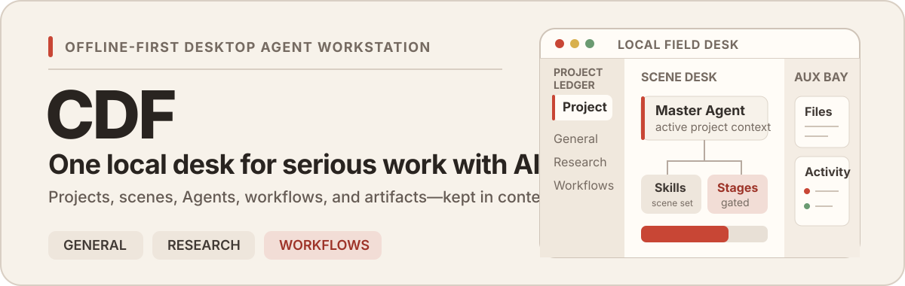

<p align="center">
  
</p>

<p align="center">
  <strong>English</strong> · <a href="./README.zh-CN.md">简体中文</a>
</p>

<p align="center">
  
  
  
</p>

CDF is an **offline-first desktop Agent workstation** for work that should outlive a chat tab. It keeps a local Project, its conversations, scene-specific Skills, Agent activity, workflows, files, and artifacts in one durable working context.

Today, CDF ships two complete Scene foundations—**General** and **Research**—with more specialized professional desks planned.

## The desk, in one frame

The interface has three stable zones: **Project Ledger** on the left, **Scene Desk** in the center, and an on-demand **Auxiliary Bay** for files and activity on the right. The current Project stays visible while the work changes.

<p align="center">
  
</p>

## Why CDF

### Work by Scene, not by model

A Project is created for a professional context, not for a provider. The General Scene handles everyday multimodal work. The Research Scene adds a Paper Library and a focused set of Skills for paper search, collection, reading, local PDF parsing, manuscript review, and academic revision.

### Connect capabilities without turning a provider into the product

**AI Subscriptions** exposes supported routes from accounts you already use:

- **MiniMax Token Plan** for text reasoning plus image, video, speech, and music workflows.
- **Codex OAuth** for supported text, code, and image workflows.
- **xAI Grok OAuth** for supported text and media workflows.

Connections and capability switches are explicit. CDF selects from enabled routes instead of forcing every task through one model vendor.

<p align="center">
  
</p>

### Keep long work inspectable

Workflow Runs turn a complex task into named Stages. A selected model drives the Master Agent, Stage Gates pause at decision boundaries, and the run record preserves progress, approvals, failures, and outputs instead of hiding them inside an autonomous loop.

<p align="center">
  
</p>

### Give research its own working surface

The Research Scene keeps conversation and literature work in the same Project context. Its Paper Library supports searchable local entries, paper metadata, collection, PDF opening, and the built-in research Skill chain.

<p align="center">
  
</p>

## Local by default, network by choice

CDF stores application state in local SQLite-backed storage and roots each Project in a directory selected by the user. Filesystem, shell, MCP, browser, and model-provider operations stay in the Electron main process and cross a minimal preload IPC boundary.

External AI providers, scholarly search, and browser-assisted reading still require network access when invoked. Those connections are visible, configurable, and allowed to fail without redefining the local Project as a cloud workspace.

## Quick start

### Requirements

- Node.js `>=22`
- pnpm `11.5.1`
- macOS, Windows, or Linux desktop environment

### Run from source

```bash
git clone https://github.com/suntianc/CDF.git
cd CDF
pnpm install
pnpm run dev:electron
```

`dev:electron` is the recommended start command because it rebuilds `better-sqlite3` for the Electron ABI before launching the app.

> [!WARNING]
> `pnpm test` rebuilds `better-sqlite3` for the Node.js ABI. After testing, use `pnpm run dev:electron` before launching the desktop app again. Do not delete the lockfile to work around an ABI mismatch.

### Common commands

| Command | Purpose |
| --- | --- |
| `pnpm run dev:electron` | Rebuild the native database module for Electron and start development |
| `pnpm test` | Run the Vitest suite in the Node.js environment |
| `pnpm run typecheck` | Type-check the main/preload and renderer targets |
| `pnpm run build` | Build the Electron main, preload, renderer, and paper-search runtime |
| `pnpm run preview` | Preview the compiled Electron application |

## Build targets

CDF can be built for the targets below. The optional **Obscura** browser-assisted reader is included only where this repository carries a matching native binary.

| Target | Application | Bundled Obscura |
| --- | :---: | :---: |
| macOS x86_64 DMG | Yes | Yes |
| macOS ARM64 DMG | Yes | Yes |
| Windows x86_64 NSIS / MSI | Yes | Yes |
| Windows ARM64 NSIS / MSI | Yes | No |
| Linux x86_64 DEB / RPM | Yes | No |

Missing Obscura support does not disable the rest of CDF; invoking that optional route reports that no matching binary is bundled.

## Architecture

```text
Renderer                 Preload boundary             Main process
React 19                 contextBridge                Electron + IPC
Scene workspaces   ───▶  minimal typed APIs    ───▶  Agent / Workflow runtime
Zustand projections                                  SQLite / filesystem / MCP
                                                     provider connections
```

- [`src/renderer/`](./src/renderer/) contains the React workbench and user-visible projections.
- [`src/preload/`](./src/preload/) exposes the smallest renderer-safe API surface.
- [`src/main/`](./src/main/) owns high-privilege operations, persistence, Agents, capabilities, and Workflow Runs.
- [`src/shared/`](./src/shared/) holds types and constants shared across process boundaries.

The Electron window keeps `contextIsolation: true` and `nodeIntegration: false`.

## Current scope and roadmap

- [x] General Scene and local Project workbench
- [x] Research Scene, Paper Library, and built-in research Skills
- [x] MiniMax Token Plan, Codex OAuth, and xAI Grok OAuth connections
- [x] Stage-based Workflow Runs with Gate decisions
- [ ] Additional creative, design, and analysis Scenes

Roadmap items describe direction, not a compatibility promise or release date.

## Contributing and license

Issues, design proposals, and pull requests are welcome. Before changing the codebase, read [AGENTS.md](./AGENTS.md) for repository rules, test expectations, and Electron security boundaries.

CDF is licensed under the [GNU Affero General Public License v3.0](./LICENSE).

## Acknowledgements

CDF is built with and informed by open-source work across several layers:

- **Desktop and interface:** [Electron](https://www.electronjs.org/), [electron-vite](https://electron-vite.org/), [React](https://react.dev/), [Tailwind CSS](https://tailwindcss.com/), [Radix UI](https://www.radix-ui.com/), and [Lucide](https://lucide.dev/).
- **Agent runtime:** [LangChain](https://js.langchain.com/), [LangGraph](https://langchain-ai.github.io/langgraphjs/), [deepagents](https://github.com/langchain-ai/deepagentsjs), and the [Model Context Protocol](https://modelcontextprotocol.io/).
- **Local workbench:** [better-sqlite3](https://github.com/WiseLibs/better-sqlite3), [Zustand](https://zustand.docs.pmnd.rs/), [React Flow](https://reactflow.dev/), [Monaco Editor](https://microsoft.github.io/monaco-editor/), and [Excalidraw](https://excalidraw.com/).
- **Integrated research capabilities:** [paper-search-cli](https://github.com/dr-dumpling/paper-search-cli), [Obscura](https://github.com/h4ckf0r0day/obscura), and [Marker](https://github.com/VikParuchuri/marker).
- **Skill references:** [scientific-agent-skills](https://github.com/K-Dense-AI/scientific-agent-skills) and [humanizer](https://github.com/blader/humanizer) informed parts of CDF's research writing and review workflows.

<p align="center"><strong>CDF · Local Field Desk</strong></p>
