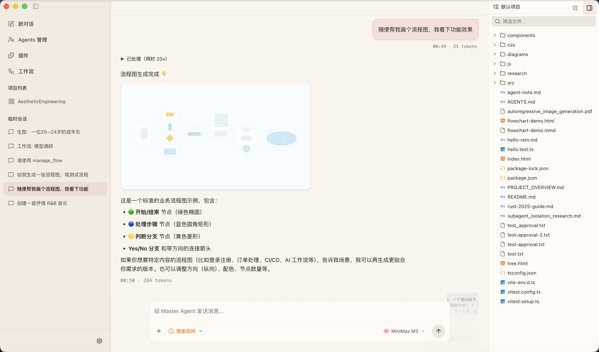
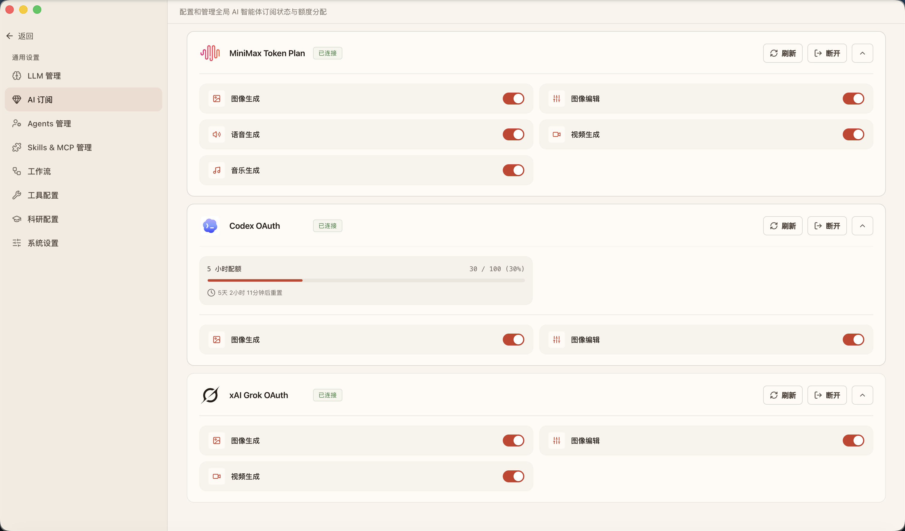
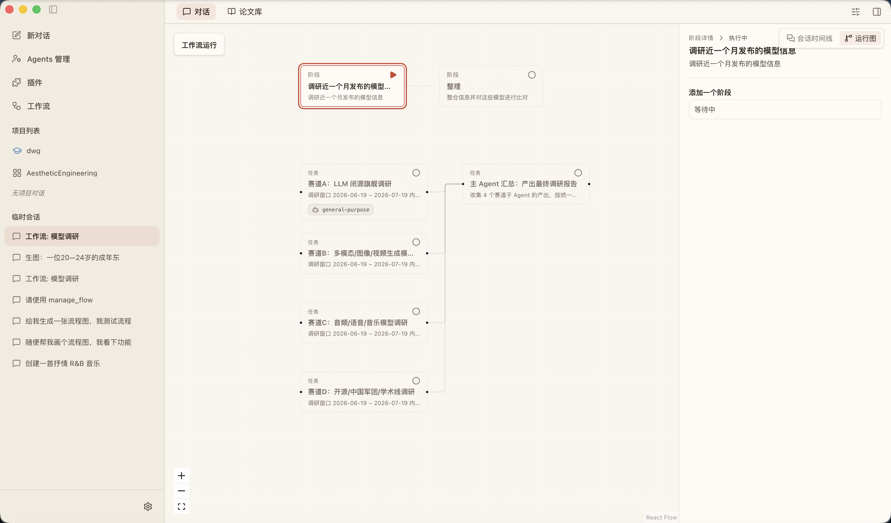
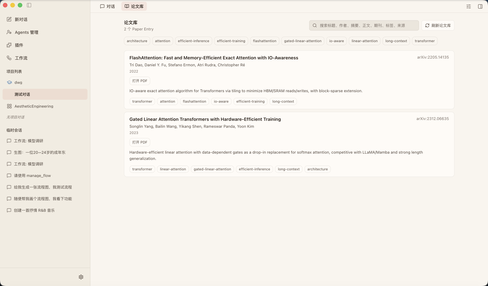

<div align="center">
  <br />
  
  <br />
  <br />

  # CDF
  
  ### ── Local Field Desk ──
  
  **An offline-first desktop AI workstation designed for long-term creation, research, and professional workflows.**

  *Reclaiming the tactile order of a physical desk, replacing fragmented conversations scattered across endless browser tabs.*

  <p>
    <a href="README.zh-CN.md">简体中文</a> • <strong>English</strong>
  </p>

  <p>
    <a href="#design-philosophy-local-field-desk">Design Philosophy</a> •
    <a href="#core-features">Core Features</a> •
    <a href="#interface-tour">Interface Tour</a> •
    <a href="#tech-stack">Tech Stack</a> •
    <a href="#quick-start">Quick Start</a> •
    <a href="#roadmap">Roadmap</a>
  </p>
  
  <p align="center">
    
    
    
  </p>
</div>

---

## Design Philosophy: Local Field Desk

CDF does not position itself as a narrow Coding Agent, nor does it compete in the all-in-one Hermes/Openclaw Agent track. Instead, it redefines the physical boundaries of human-AI collaboration through "Scenes".

> **Cinnabar Ink and Geometrical Order.**  
> CDF uses **Cinnabar Red** (Vermilion) as its sole global accent color to guide your focus toward critical decisions. We intentionally reject superficial purple-blue AI gradients, neon glows, and glassmorphism, offering instead a sober and respectful visual rhythm for high-intensity professional work.

---

## Core Features

### Scene Workspaces (Scenes) — Switched by Profession, Not by LLMs

AI shouldn't bundle writing, coding, image generation, and literature research into a single generic text box. In CDF, every specialized workflow is assigned its own dedicated Scene Desk:

*   **General Workspace**  
    Accommodates daily multimodal tasks spanning brainstorming, copywriting, coding, illustration, and media production. Project files, conversations, and generated artifacts are naturally gathered under a single local directory.
*   **Research Scene**  
    Provides a unified local context for reading, literature search, experimentation logs, and academic writing. Features an integrated **Paper Library** supporting scholarly search, one-click collection, local PDF parsing, and academic style revision.
*   **Expanding Scenes (Coming Soon)**  
    Dedicated creative, design, and analysis workspaces are on the way. There is no need to switch applications—you get native interfaces tailored to different professions on the exact same desk.

---

### Single Connection: Bring Your Own AI Subscriptions

You don't need to purchase yet another proprietary API plan. Centralized account connection serves as an entry point, not a product silo:

*    **MiniMax Token Plan**: Powers text reasoning, multimodal chat, and high-quality image, video, voice, and music generation.
*    **Codex / GPT OAuth**: Authorizes text reasoning, coding, and image generation using your logged-in accounts.
*    **xAI Grok OAuth**: Utilizes long-context reasoning and multimodal analysis for complex data extraction and generation.

> **Capabilities as Routing**: Centralized account connection serves as an entry point, not a product silo. You never have to bounce between different web pages or applications to write a prompt, generate a diagram, compose audio, or compile research.

---

### Task Orchestration: Workflow Skeleton & Gate Approvals

When a task exceeds the capability of a single conversation, CDF's Workflow Skeleton structures complex processes into predictable **Stages** and acceptance criteria:
*   **Gate-based Approvals**: Critical execution nodes pause and await human confirmation or correction, preventing the illusion of a fragile "autonomous loop."
*   **Ledger Edge**: Pending approvals, runtime failures, and primary artifacts are pinned with a vertical Cinnabar Red stripe, ensuring high-priority items are instantly visible.

> Currently, the workflow system is in an early stage and has not yet been integrated with the main Agent; it is temporarily triggered manually.

---

## Interface Tour

> [!TIP]
> The CDF layout consists of three primary functional zones: the **Project Ledger** (left) tracks project contexts, the **Scene Desk** (center) hosts the main workspace canvas, and the **Auxiliary Bay** (right) opens files and task activities on demand.

| The Local Project Desk | Multimodal Subscription Center |
| :---: | :---: |
|  |  |
| *Project ledger, main workspace, and auxiliary bay co-exist cleanly.* | *Centrally manage MiniMax, Codex, and Grok; media generation is one click away.* |

| Complex Task Workflows | Long-term Academic Research |
| :---: | :---: |
|  |  |
| *Workflow stage progression and gate-based approvals.* | *Integrated scholarly search, paper database, and paper parsing.* |

---

## Tech Stack

CDF adheres strictly to **offline-first** architecture and secure desktop sandboxing practices.

```text
 ┌────────────────────────────────────────────────────────────────────────┐
 │                          CDF DESKTOP SYSTEM                            │
 ├───────────────────┬────────────────────────┬───────────────────────────┤
 │ PRESENTATION      │ AGENT RUNTIME          │ LOCAL STORAGE & VISUAL    │
 ├───────────────────┼────────────────────────┼───────────────────────────┤
 │ • Electron & Vite │ • LangChain & LangGraph│ • better-sqlite3 (SQLite) │
 │ • React 19        │ • deepagents           │ • Zustand State Store     │
 │ • Tailwind CSS v4 │ • Model Context        │ • React Flow Canvas       │
 │ • Radix UI        │   Protocol (MCP)       │ • Monaco & Excalidraw     │
 └───────────────────┴────────────────────────┴───────────────────────────┘
```

> **Quality Assurance**: Our end-to-end testing suite is driven by [Vitest](https://vitest.dev/) and [Testing Library](https://testing-library.com/), guarding Electron main IPC boundaries and React renderer actions.

---

## Quick Start

### Prerequisites

*   **Node.js** `>= 22.0.0`
*   **Package Manager** `pnpm` `@11.5.1`
*   **OS Support** macOS / Windows / Linux (desktop environments)

### Packaged Capability Support

CDF packages are available for the platforms below, but the optional **Obscura browser-assisted page reader** is bundled only where a matching native binary exists:

| Package | CDF application | Bundled Obscura |
| :--- | :---: | :---: |
| macOS x86_64 DMG | ✓ | ✓ |
| macOS ARM64 DMG | ✓ | ✓ |
| Windows x86_64 NSIS / MSI | ✓ | ✓ |
| Windows ARM64 NSIS / MSI | ✓ | Not bundled |
| Linux x86_64 DEB / RPM | ✓ | Not bundled |

> On Windows ARM64 and Linux x86_64, CDF remains available, but invoking Obscura reports that no binary is bundled for the current platform. Other application capabilities are unaffected.

### Build & Run Locally

Because CDF depends on native database modules (`better-sqlite3`), running tests and development environments requires rebuilding modules for target runtimes:

```bash
# 1. Clone and install dependencies
pnpm install

# 2. Launch the Electron app (rebuilds sqlite for the Electron ABI automatically)
pnpm run dev:electron
```

### Common Commands

| Command | Description | ABI State / Notes |
| :--- | :--- | :--- |
| `pnpm run dev:electron` | **Run App (Development)** | Automatically rebuilds native modules to the **Electron ABI** *(Recommended)* |
| `pnpm test` | **Run Unit Tests (Vitest)** | Rebuilds native modules to the **Node ABI** before running tests |
| `pnpm run build` | **Build App Packages** | Compiles main/preload/renderer targets with type-safety checks |
| `pnpm run preview` | **Preview Local Build** | Validates the compiled Electron application locally |

> [!WARNING]
> **Native ABI Conflicts**: After running `pnpm test`, starting the app might crash due to SQL module mismatches. Always run `pnpm run dev:electron` to restore the correct Electron ABI. **Do not** delete the package lockfile or force-reinstall dependencies.

---

## Project Structure

Following Electron security guidelines, CDF isolates high-privilege capabilities from the UI layer:

```text
CDF/
├── src/
│   ├── main/        # Electron Main Process (IPC, SQLite, Agent & Workflow execution)
│   ├── preload/     # contextBridge API exposing safe boundaries to the Renderer
│   ├── renderer/    # React Renderer Process (Scene Workspaces, Zustand, i18n)
│   └── shared/      # Shared TypeScript types and constants across processes
├── docs/            # Domain architecture guidelines and ADRs
├── resources/       # Static app resources and installer icons
└── patches/         # Local dependency patches via patch-package
```

> **Security Policy**: Maintain `contextIsolation: true` and `nodeIntegration: false`. File systems, shell command execution, MCP servers, and LLM providers reside strictly in the [main process](file:///Users/suntc/project/CDF/src/main/) and are requested via [preload](file:///Users/suntc/project/CDF/src/preload/) IPC channels.

---

## Contribution & License

We highly welcome proposals, design ideas, and pull requests for custom Scenes and Skills:
*   Before submitting code, please carefully read our [AGENTS.md](file:///Users/suntc/project/CDF/AGENTS.md) guidelines.
*   CDF is licensed under the [AGPL-3.0 License](https://www.gnu.org/licenses/agpl-3.0.html).

---

## Roadmap

- [x] **General Agent Scene**
- [x] **Basic Research Scene**
- [x] **v1.0 Capabilities Refinement & Polishing**
- [ ] **Design Scenes (In Progress)**
- [ ] **To Be Planned...**

---

## Credits

CDF stands on the shoulders of the open-source community. Our deepest gratitude goes out to the creators of these foundational projects:

*   **Application Shell**: [`Electron`](https://www.electronjs.org/) and [`electron-vite`](https://electron-vite.org/) for multi-platform desktop sandboxing.
*   **Tactile Interfaces**: [`React`](https://react.dev/), [`TypeScript`](https://www.typescriptlang.org/), [`Tailwind CSS`](https://tailwindcss.com/), [`Radix UI`](https://www.radix-ui.com/), and [`Lucide Icons`](https://lucide.dev/).
*   **Agent Runtime**: [`LangChain`](https://js.langchain.com/), [`LangGraph`](https://langchain-ai.github.io/langgraphjs/), [`deepagents`](https://github.com/langchain-ai/deepagentsjs), and the [`Model Context Protocol (MCP)`](https://modelcontextprotocol.io/).
*   **Local Engine**: [`better-sqlite3`](https://github.com/WiseLibs/better-sqlite3) for native DB queries, [`Zustand`](https://zustand.docs.pmnd.rs/) for state syncing, and [`React Flow`](https://reactflow.dev/) for canvas visualizations.
*   **Integrated Capabilities**:
    *   [`paper-search-cli`](https://github.com/dr-dumpling/paper-search-cli) for scholarly queries and academic metadata ingestion.
    *   [`Obscura`](https://github.com/h4ckf0r0day/obscura) for structurizing browser navigation under crawler skills.
    *   [`Marker`](https://github.com/VikParuchuri/marker) for robust local PDF markdown extraction.
    *   [`scientific-agent-skills`](https://github.com/K-Dense-AI/scientific-agent-skills) and [`humanizer`](https://github.com/blader/humanizer) for inspiring manuscript review techniques.

<p align="center">
  <b>CDF • Local Field Desk AI Workspace</b>
</p>
