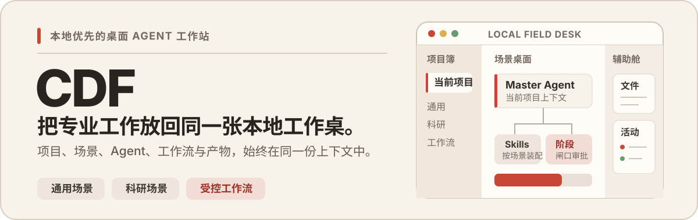

<p align="center">
  
</p>

<p align="center">
  <a href="./README.md">English</a> · <strong>简体中文</strong>
</p>

<p align="center">
  
  
  
</p>

CDF 是一款服务于长线工作的**本地优先桌面 Agent 工作站**。它把本地 Project、对话、按场景装配的 Skills、Agent 活动、工作流、文件与产物收拢到一份可持续使用的工作上下文中，而不是把它们留在一个随时会被关闭的聊天标签页里。

目前 CDF 已形成两种完整的 Scene 基座：**通用场景**与**科研场景**，后续将继续扩展更多专业工作桌。

## 一张工作桌，承接完整上下文

界面由三个稳定区域组成：左侧 **Project Ledger（项目簿）**持续显示当前项目，中间 **Scene Desk（场景桌面）**承载主要工作，右侧 **Auxiliary Bay（辅助舱）**按需打开文件与活动。工作内容可以变化，但当前 Project 不会从视线和上下文中消失。

<p align="center">
  
</p>

## CDF 解决什么问题

### 按场景工作，而不是按模型切换

Project 面向专业语境创建，而不是面向某个供应商创建。通用场景承接日常多模态任务；科研场景增加 Paper Library，并装配文献检索、收集、阅读、本地 PDF 解析、论文审稿与学术风格修订等专用 Skills。

### 连接能力，而不是把供应商变成产品边界

**AI Subscriptions** 将用户已有账号所支持的能力路由统一呈现：

- **MiniMax Token Plan**：文本推理，以及图像、视频、语音和音乐工作流。
- **Codex OAuth**：受支持的文本、代码与图像工作流。
- **xAI Grok OAuth**：受支持的文本与媒体工作流。

连接状态与能力开关始终显式可见。CDF 从已启用的路由中选择能力，而不是强迫所有任务经过同一家模型供应商。

<p align="center">
  
</p>

### 让长任务可检查、可审批

Workflow Run 将复杂任务拆成具名 Stage。选定模型驱动 Master Agent，Stage Gate 在关键决策边界暂停，运行记录持续保留进度、审批、异常与产物，而不是把过程藏进一个不可解释的“全自动循环”。

<p align="center">
  
</p>

### 给科研工作一块原生桌面

科研场景让对话与文献工作共享同一个 Project 上下文。Paper Library 支持本地条目检索、论文元数据、收集、PDF 打开，以及内置科研 Skill 链。

<p align="center">
  
</p>

## 本地是默认边界，联网是显式选择

CDF 使用本地 SQLite 存储应用状态，并将每个 Project 锚定在用户选择的本地目录。文件系统、Shell、MCP、浏览器与模型供应商等高权限操作保留在 Electron 主进程，通过最小化的 preload IPC 边界提供给界面。

外部 AI 供应商、学术检索与浏览器辅助阅读在实际调用时仍需要网络。它们的连接状态可见、可配置，也可以独立失败；本地 Project 不会因此被重新定义成云端工作区。

## 快速开始

### 环境要求

- Node.js `>=22`
- pnpm `11.5.1`
- macOS、Windows 或 Linux 桌面环境

### 从源码运行

```bash
git clone https://github.com/suntianc/CDF.git
cd CDF
pnpm install
pnpm run dev:electron
```

推荐使用 `dev:electron` 启动，因为它会先将 `better-sqlite3` 重新构建到 Electron ABI，再启动应用。

> [!WARNING]
> `pnpm test` 会将 `better-sqlite3` 重新构建到 Node.js ABI。测试结束后，如需启动桌面应用，请再次使用 `pnpm run dev:electron`。不要通过删除 lockfile 来绕过 ABI 不匹配。

### 常用命令

| 命令 | 用途 |
| --- | --- |
| `pnpm run dev:electron` | 为 Electron 重建原生数据库模块并启动开发环境 |
| `pnpm test` | 在 Node.js 环境运行 Vitest 测试 |
| `pnpm run typecheck` | 检查 main/preload 与 renderer 的 TypeScript 类型 |
| `pnpm run build` | 构建 Electron main、preload、renderer 与 paper-search runtime |
| `pnpm run preview` | 预览已编译的 Electron 应用 |

## 构建目标

CDF 可面向下列目标构建。可选的 **Obscura 浏览器辅助阅读能力**仅在仓库内存在匹配的原生二进制时随包提供。

| 目标 | 主应用 | 内置 Obscura |
| --- | :---: | :---: |
| macOS x86_64 DMG | 是 | 是 |
| macOS ARM64 DMG | 是 | 是 |
| Windows x86_64 NSIS / MSI | 是 | 是 |
| Windows ARM64 NSIS / MSI | 是 | 否 |
| Linux x86_64 DEB / RPM | 是 | 否 |

缺少 Obscura 不会禁用 CDF 的其他能力；调用该可选路由时，应用会明确说明当前包中没有匹配的二进制。

## 技术架构

```text
Renderer                 Preload 边界                Main 进程
React 19                 contextBridge                Electron + IPC
场景工作桌         ───▶  最小化类型 API        ───▶  Agent / Workflow 运行时
Zustand 投影视图                                      SQLite / 文件系统 / MCP
                                                     模型供应商连接
```

- [`src/renderer/`](./src/renderer/)：React 工作桌与所有用户可见的投影视图。
- [`src/preload/`](./src/preload/)：向渲染进程暴露最小、安全的 API。
- [`src/main/`](./src/main/)：承载高权限操作、持久化、Agents、能力路由与 Workflow Runs。
- [`src/shared/`](./src/shared/)：维护跨进程共享的类型与常量。

Electron 窗口保持 `contextIsolation: true` 与 `nodeIntegration: false`。

## 当前范围与路线图

- [x] 通用场景与本地 Project 工作桌
- [x] 科研场景、Paper Library 与内置科研 Skills
- [x] MiniMax Token Plan、Codex OAuth 与 xAI Grok OAuth 连接
- [x] 基于 Stage 与 Gate 决策的 Workflow Runs
- [ ] 更多创作、设计与分析场景

路线图只表达产品方向，不构成兼容性承诺或发布日期。

## 贡献与许可

欢迎提交 Issue、设计建议与 Pull Request。修改代码前，请先阅读 [AGENTS.md](./AGENTS.md)，了解仓库规则、测试要求与 Electron 安全边界。

CDF 使用 [GNU Affero General Public License v3.0](./LICENSE) 开源。

## 致谢

CDF 建立在多层开源工作之上，也从中获得了直接启发：

- **桌面与界面：**[Electron](https://www.electronjs.org/)、[electron-vite](https://electron-vite.org/)、[React](https://react.dev/)、[Tailwind CSS](https://tailwindcss.com/)、[Radix UI](https://www.radix-ui.com/) 与 [Lucide](https://lucide.dev/)。
- **Agent 运行时：**[LangChain](https://js.langchain.com/)、[LangGraph](https://langchain-ai.github.io/langgraphjs/)、[deepagents](https://github.com/langchain-ai/deepagentsjs) 与 [Model Context Protocol](https://modelcontextprotocol.io/)。
- **本地工作桌：**[better-sqlite3](https://github.com/WiseLibs/better-sqlite3)、[Zustand](https://zustand.docs.pmnd.rs/)、[React Flow](https://reactflow.dev/)、[Monaco Editor](https://microsoft.github.io/monaco-editor/) 与 [Excalidraw](https://excalidraw.com/)。
- **内置科研能力：**[paper-search-cli](https://github.com/dr-dumpling/paper-search-cli)、[Obscura](https://github.com/h4ckf0r0day/obscura) 与 [Marker](https://github.com/VikParuchuri/marker)。
- **Skill 参考：**[scientific-agent-skills](https://github.com/K-Dense-AI/scientific-agent-skills) 与 [humanizer](https://github.com/blader/humanizer) 为 CDF 的科研写作和审稿工作流提供了参考。

<p align="center"><strong>CDF · Local Field Desk</strong></p>
